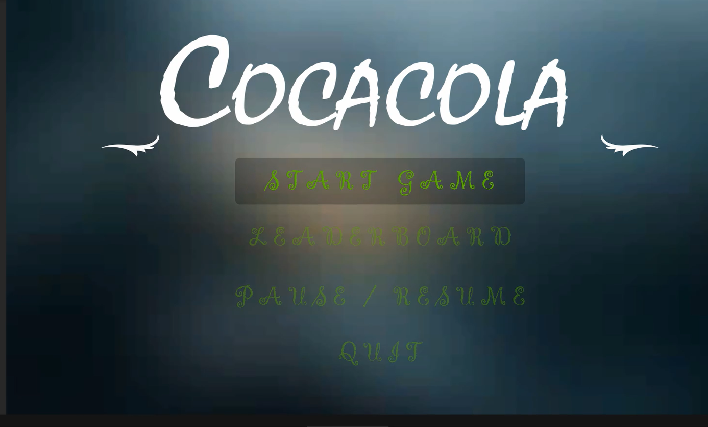
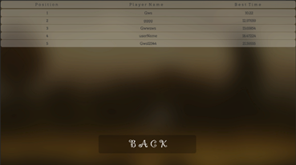
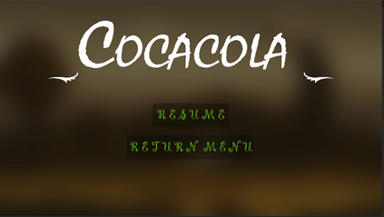
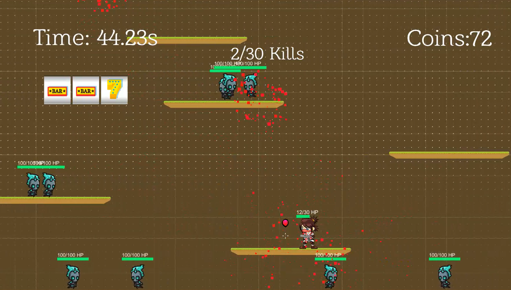
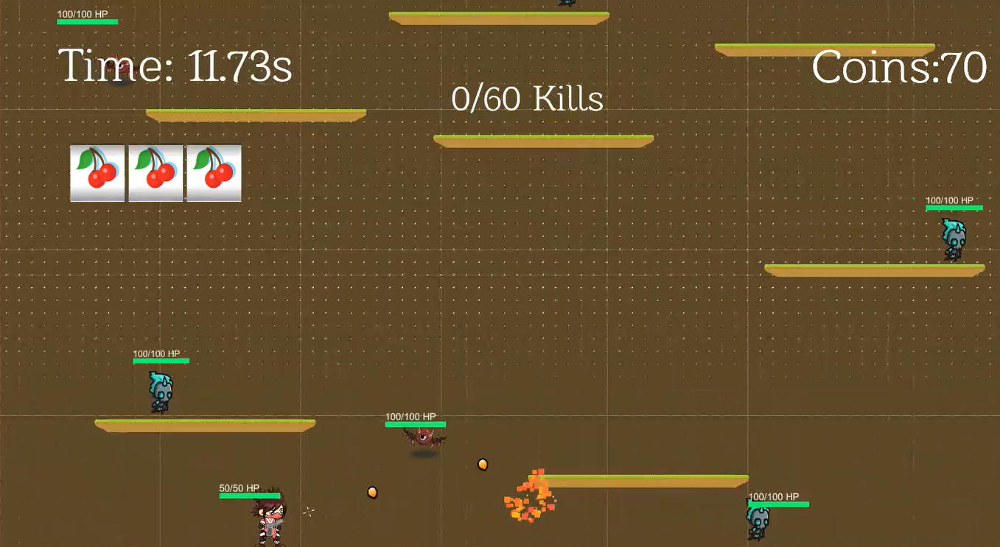
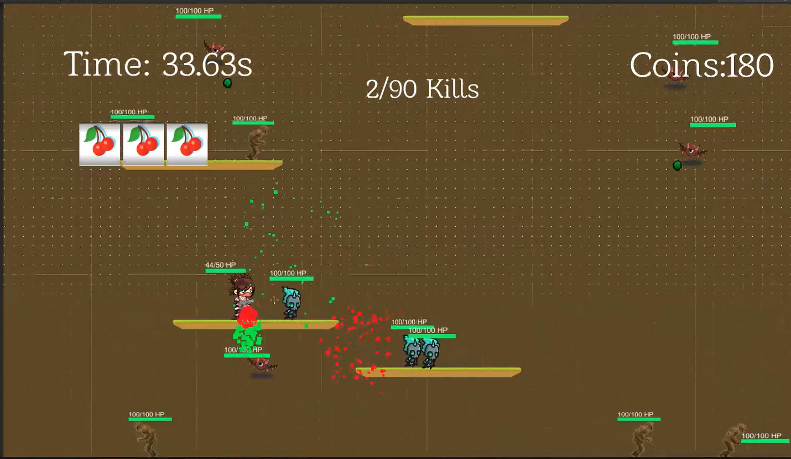
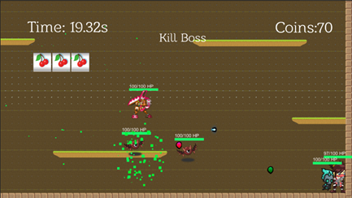
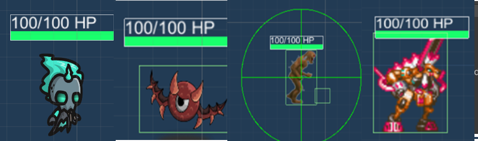
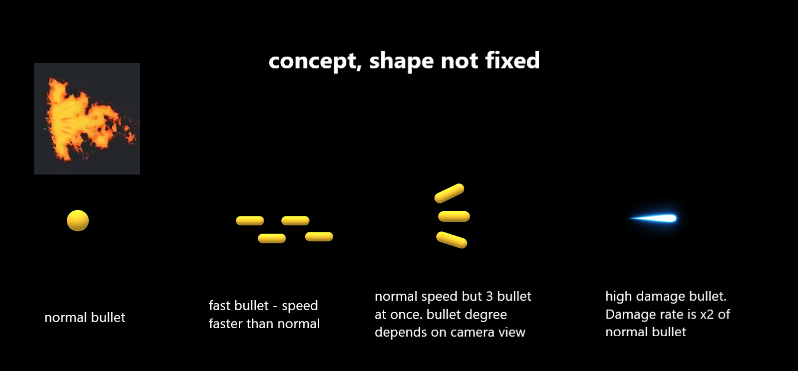

# 2D-Platformer-Shooting-Game

## Overview

Coca-cola is a 2D-platformer shooting game developed using Unity. The game revolves around a female ninja character who must rescue herself from the clutches of the Monster Corp. Players navigate through a series of levels, each with unique challenges, to ultimately defeat a boss and escape the dangerous environment.

The game will start with a female ninja character trapped in a box-shaped environment with a lot of moving platforms. In this environment, the character needs to kill a targeted quantity of monster to proceed to the next level with different special effects and weapons. It has 4 level in this game, which would have different game environments, types of monsters and different target quantity enemy to be killed. In the last level,the character has to deal with a Boss to pass the game. Upon completing all 4 levels, players will be presented with a victory screen where they can enter their name into the scoreboard. The scoreboard tracks and displays the players who completed the game in the shortest amount of time.

  
  
  

## Special Game Features

- **Slot Machine:** Allows players to gain special effects or switch weapons based on the result of the spin. Effects include health recovery, weapon upgrades, and temporary buffs (e.g., sheild).
- **Boss Teleportation:** The final boss has the ability to teleport to different locations on the map, adding an extra layer of challenge.

## Levels and Environments

There are `4 level in this game`, each level has a different landscape and different winning conditions as shown in the table below:

| Level | Enemies                  | Winning Condition                                     | Platform Movement                   |
|-------|--------------------------|-------------------------------------------------------|------------------------------------|
| I     | Enemy Type 1             | Defeat 30 enemies                                    | Horizontal                         |
| II    | Enemy Type 1, 2          | Defeat 60 enemies                                    | Vertical                           |
| III   | Enemy Type 1, 2, 3       | Defeat 90 enemies                                    | Circular                           |
| IV    | Enemy Type 1, 2, 3 + Boss| Defeat the Boss (other enemies can remain alive)     | Horizontal                         |

  
  

  
  

## Enemies
There are `4 type of enemy` in this game, each have different attack pattern and moving pattern.

  

- **Type 1:** Patrolling enemy with horizontal direction that shoots bullets. Rewards 10 coins per defeat.
- **Type 2:** Flying enemy that always locate and targets the player and shoots bullets. Rewards 60 coins per defeat.
- **Type 3:** Self-explosive enemy that explodes when near the player. Rewards 100 coins per defeat.
- **Type 4:** Boss enemy with teleportation ability and dual attack modes. No coin reward upon defeat as it signifies winning the game.

## Weapons

The game features `4 types of weapons`, each with unique attack modes and bullet patterns, as illustrated in the figure. Players can obtain special weapons through the slot machine mechanism. These special weapons will be retained until the player spins the slot machine again. If the player spins the slot machine, the weapon may switch to a new one based on the spin results, or revert to the default weapon if a buff is obtained.

  

- **Normal Weapon:** A pistol with a single bullet per shot.
- **Fast Shooting Weapon:** Higher shooting speed than the normal weapon.
- **Shotgun:** Fires 3 bullets per shot.
- **High Damage Weapon:** Deals double the damage of the normal weapon.

## Technical Specifications

**Minimum Hardware Requirements:**
- Operating System: Windows 8 64-bit
- Graphics: 2GB
- Hard Disk: 256GB
- Processor: Quad-core Intel or AMD, 2.5GHz or faster
- Memory: 8GB RAM

**Recommended Hardware Requirements:**
- Operating System: Windows 10 64-bit
- Graphics: 4GB
- Hard Disk: 512GB SSD
- Processor: Quad-core Intel or AMD, 2.7GHz or faster
- Memory: 16GB RAM

## Installation and Play

1. Clone the repository to your local machine.
2. Open the project in Unity.
3. Build and run the game within the Unity editor.

Feel free to explore the game and modify it as needed to enhance or add features!

## Contributors
-  VICRACE CHAN JIA LIN
-  TAN CARLSON
-  GOH WAY SIANG
-  TAN EONG SEANG
